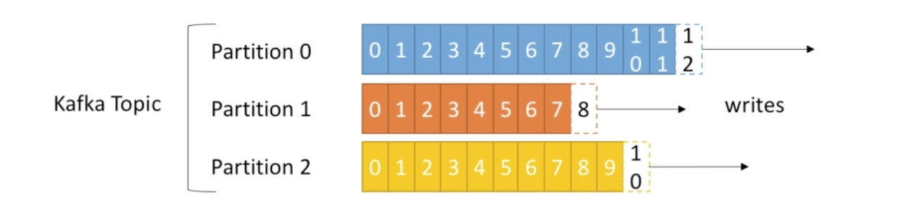

**Notes:**

**Traditional Architectures:**

Systems direct connections/integration with other multiple systems creating performance bottleneck, dependencies eventually leading to maintenance issues.

**For example:** If you have 6 source systems and 6 target systems, there is a possibility of 36 integrations and also each integration
comes with difficulties around protocol, data formats, schema dependencies etc etc..

This is where Apache Kafka ( _a high throughout distributed messaging system_ ) makes sense, it decouples source and target systems.
And also it is distributed, highly scalable, resilient and fault tolerant.

**Popular Use cases**

 * Messaging System - Decouple system dependencies
 * Activity Tracking
 * Gather Metrics
 * Application logs processing
 * Stream Processing using kafka streams

**Topics**

Topic - a particular stream of data - similar to table in a database
Topic can identified as a name 

Topics are split into partitions

 * Each partition is ordered.
 * Each message in partition gets an incremental id, called Offset
 * Offset start from 0 - unbounded (infinite) 
 * Order is only guaranteed with in a partition
 * Date is kept for one week by default
 * Once the data is written to partition it can't change 
 * Messages are assigned to partition randomly unless there is key defined, kafka guarantees messages with key always goes to same partition all the time
 
 

**Brokers**

* A kafka cluster ( multiple machines ) is compose of multiple brokers (servers)
* Each broker is identified by a "id"
* Each broker contains certain topic partitions 
* After connecting to any broker (called a bootstrap broker ), you will be connected to entire cluster
* Topics should have a replication factor >1 ( usually between 2 and 3), this way if a broker is down another broker can serve the data
* At any time only once broker can be leader of the given partition , only that leader can receive and serve data for a partition 
* Therefore each partition has only one leader and multiple ISR (in-sync replica)
* Every kafka broker is a bootstrap broker 
* Each broker knows about all brokers, topics and partitions ( metadata)

**Producers**

* Producers write data to topics 
* Producers automatically know which broker and partition to write.
* In case of broker is down, producers automatically recover
* Producers can choose acknowledgement of data writes ( ack = 0 , 1 and all ) - choose wisely 
* Messages produced with out key ( key is null ) will be sent to brokers in a round robin fashion 
* A key is needed if we need to read messages in a ordered fashion 

**Consumers**

* Consumer read data from a topic
* Consumers read data in order with in each partition

**Consumer Groups**

* Consumer reads data in consumer groups
* Each consumer within a group reads from exclusive partitions
* If you have more consumers than partitions, some consumers will be inactive

**Consumer Offsets**
* Kafka stores offsets at which a consumer group has been reading.
* The offsets committed live in kafka topic __consumer_offsets
* Consumer can choose when to commit offsets - at most once ( commit after as soon as the message is received), at least once (offsets are committed after the message is processed)

**Zookeeper**
* Zookeeper manages brokers
* Zookeeper elects leader for a partition 
* Zookeeper by design operates in odd number of servers
* Kafka manages all metadata in Zookeeper

**Command Line**

**Start Services** Start Zookeeper and Kafka

`> brew services start zookeeper`
`> brew services start kafka`

**Topic**

**Create Topic:** Creates topic third_topic with 3 partitions and replication 1 

 `> kafka-topics --zookeeper 127.0.0.1:2181 --topic third_topic --create --partitions 3 --replication-factor 1`
 
**List Topics**

 `> kafka-topics --zookeeper 127.0.0.1:2181 --list`
 
**Describe Topic:**

 `> kafka-topics --zookeeper 127.0.0.1:2181 --topic first_topic --describe`

**Delete Topic:** Marks the topic for delete

 `> kafka-topics --zookeeper 127.0.0.1:2181 --topic first_topic --delete`

**Producer**

 `> kafka-console-producer --broker-list 127.0.0.1:9092 --topic first_topic`
 
 
 `> kafka-console-producer --broker-list 127.0.0.1:9092 --topic first_topic --producer-property acks=all`

 `> kafka-console-producer --broker-list 127.0.0.1:9092 --topic first_topic --property parse.key=true --property key.separator=,`

**Consumer** Consumer messages from topic -> first_topic
 
 `> kafka-console-consumer --bootstrap-server 127.0.0.1:9092 --topic first_topic`
 
 
 `> kafka-console-consumer --bootstrap-server 127.0.0.1:9092 --topic first_topic --from-beginning`
 
 
 `> kafka-console-consumer --bootstrap-server 127.0.0.1:9092 --topic first_topic --from-beginning --property print.key=true --property key.separator=,`
 
 
**Consumer Groups**

 `> kafka-console-consumer --bootstrap-server 127.0.0.1:9092 --topic first_topic --group my_new_group`
  
  
 `> kafka-consumer-groups --bootstrap-server 127.0.0.1:9092 --list`
 
 
 `> kafka-consumer-groups --bootstrap-server 127.0.0.1:9092 --describe --group my_new_group `  
 
**Command to reset offsets:**

 `> kafka-consumer-groups --bootstrap-server localhost:9092 --group kafka-elastic-search --reset-offsets --execute --to-earliest --topic twitter-tweets`
 
 
 
**Configuration** describe topic configuration 

 `> Kafka-configs --zookeeper 127.0.0.1:2181 --entity-type topics --entity-name first_topic --describe `  
 
  **Alter Config**
  
 
 `> Kafka-configs --zookeeper 127.0.0.1:2181 --entity-type topics --entity-name <topic_name> --add-config min.insync.replicas = 2 --alter`

 **Delete Config**
 
 `> Kafka-configs --zookeeper 127.0.0.1:2181 --entity-type topics --entity-name <topic_name> --delete-config min.insync.replicas = 2 --alter`